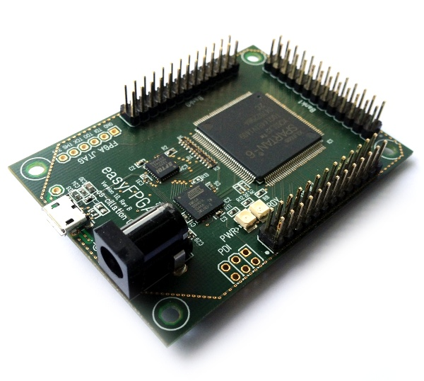

# easyFPGA Wiki

Welcome to the easyFPGA wiki! Here you will find all information required to get started with the design of FPGA based systems using the easyFPGA SDK and board. Furthermore there is a description of the easyCores that are currently available.

## SDK

* [Prerequisites](prerequisites.md)
* [Getting Started](getting_started.md)
* [Interrupts](interrupts.md)
* [Configuration](configuration.md)

## Hardware

* [easyFPGA Board](board.md)
* [MCU Update](mcu_update.md)

## easyCores

* [Frequency Divider](cores/fdiv.md)
* [PWM8](cores/pwm8.md)
* [PWM16](cores/pwm16.md)
* [GPIO8](cores/gpio8.md)
* [UART](cores/uart.md)
* [MIDI](cores/midi.md)
* [SPI Master](cores/spi.md)
* [I2C Master](cores/i2c.md)
* [CAN Wrapper](cores/can.md)
