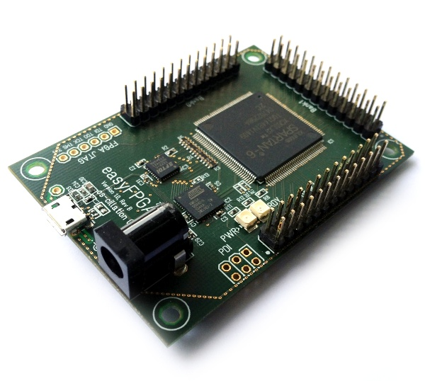
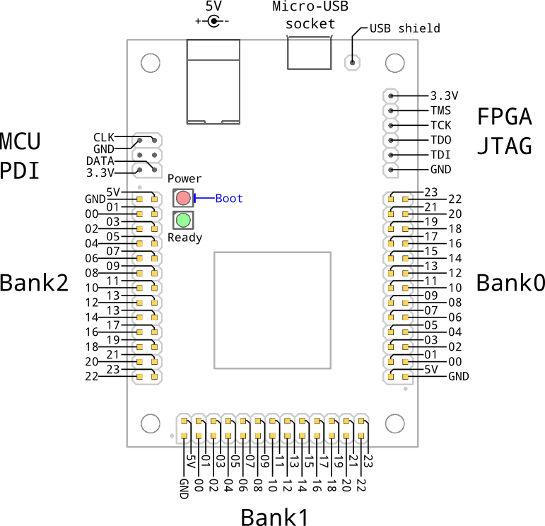

# easyFPGA Board
This articles describes the easyFPGA board's key features, the locations of GPIO pins and auxiliary connectors.

## Overview

These are the board's key features:
* Micro-USB socket
* 5 V Voltage supply using 2.5 mm barrel jack or USB
* Dimensions 70 x 50 mm, M3 mounting holes
* 72 GPIO pins, 3.3 V, 2 mA
* JTAG interface

## GPIO Pins
The board provides 72 GPIO pins that can be accessed over three 2x13-pin headers. Each header (called bank) has 24 GPIO pins plus two power pins. In the Java-SDK the pins follow the following naming convention:

'''gpio_b<bank>_<pin>'''

Bank is in the range of 0 to 2 and pin is in the range of 00 to 23. The GPIO pins follow the LVTTL (3.3 V) standard and are limited to drive a current of 2 mA. The 5 V power pins are directly connected to the voltage delivered by the USB or barrel jack. Thus, the maximum current output here depends on the USB host or external power supply. For your guidance, note the little dot next to the GND pin.

## LEDs
There are two LEDs. The red one indicates that the board is connected to a power supply. The green LED flashes while the FPGA gets configured and is constantly on, when a host established a USB connection to the FPGA.

## JTAG
For programming and debugging the FPGA using the JTAG interface, connect a Xilinx (or compatible) JTAG adapter to the designated through-hole pads.

## PDI
The microcontroller (an Atmel atxmega128a4u) can be programmed using the PDI interface. For an easier and faster approach see the [[MCU Update]] page.

## USB Shield
In some cases it might be useful to be able to connect the USB shield to a metal housing. For this purpose use the hole next to the USB socket.
