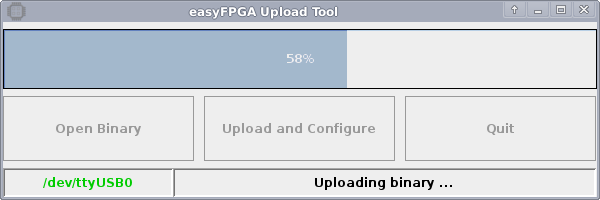

# Upload Tool
The easyFPGA board can also be used without using the SDK. Any FPGA-binary can be uploaded to the board using the upload tool which is included in the jar archive `easyFPGA.jar`.



## Upload Binary
Any binary created as described below can be uploaded via USB using the upload tool GUI. To start the GUI, run

```
java -jar easyFPGA.jar
```

without any arguments. It is also possible to use the command line by simply giving the filename of the binary as an argument:

```
java -jar easyFPGA.jar BINARY_NAME
```

Binary FPGA-configuration files have the filename extension `.bin`.

## Create Binary
A binary can be created using the Xilinx ISE WebPack which includes an IDE to implement, test and synthesize your project. In order to get a binary that can be uploaded, select these options when creating a new project:

* **Family** Spartan
* **Device** XC6SLX9
* **Package** TQG144
* **Speed** -2

Next, add the user constraint file `easyFPGA.ucf` provided by the [easyfpga-soc](https://github.com/os-cillation/easyfpga-soc/) repository as an external source. This is required to link physical pins of the device to signals used in your design. Further information regarding physical connections are given below.

In the properties of the "Translate" process (under implementation), select the option "Allow unmatched LOC constraints".

In the properties of the "Generate Programming File" process, select the option "Create Binary Configuration File". To speed up the upload process, also select the "Enable BitStream Compression" option.

Now you can start implementing, simulating and testing on the easyFPGA board.

## Project Template
For those who prefer using a non-IDE development environment, a simple hello-world template is provided by the [easyfpga-soc](https://github.com/os-cillation/easyfpga-soc/) repository (see [templates/standalone_application](https://github.com/os-cillation/easyfpga-soc/blob/master/templates/standalone_application)).

When adding further VHDL sources, the file named `xst-project` has to be extended by

```
vhdl work "my_vhdl_source.vhd"
```
It is also possible to mix VHDL and Verilog sources in one project:

```
verilog work "my_verilog_source.v"
vhdl work "my_vhdl_source.vhd"
```

The script named `build.sh` can be used to start the Xilinx toolchain to synthesize a binary. Mind to adapt the constant `DESIGN_NAME` to the name of your top-level-entity.

## Physical Connections
The user constraint file named `easyFPGA.ucf` makes up the connection between the HDL design and the hardware. In your top-level-entity you can make connections to an 8 MHz clock provided by the microcontroller and the boards GPIO pins.

The GPIO pins are accessed using names in the range of `gpio_b0_00` to `gpio_b2_23`. The 8 MHz clock signal can be used via the signal (or wire) name `clk_i`. Note that GPIOs can be either in- or output pins whereas the `clk_i` signal is always an input of the top-level-entity.
